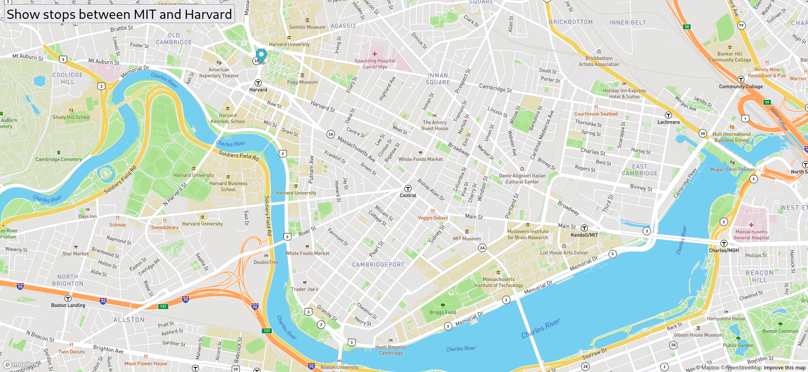

<h1 align="center">MIT to Harvard Bus Tracker</h1>

This is a bus stop tracker between the MIT maimn cumpus and the Harvard. We were allowed to use some of the libraries at Harvard, so we all made variations of this bus tracker to track our stops. This program measures all the possible stops by bus. The 38 bus route runs through this route and this program runs maps all the stops.

## Links

- [Repo](<https://github.com/naderhassan001/MIT-Harvard-BusTracker> "<project-name> Repo")

- [Live](<http://mitbustracker.s3-website-us-east-1.amazonaws.com/> "Live View")

## Screenshots

## Options for Running the Program 

In the project directory, you have a few options.

You can open the index.html file in a web browser or with the extention "liver server" in VsCode or your favorite editor. 

## Built With

- JavaScript
- HTML
- CSS

## Future Updates

- [ ] I am going to research a way to add construction warnings at the top of the page. Go to love Boston!
## Author

**Nader Hassan**

- [Profile](https://github.com/naderhassan001 "Nader Hassan")
- [Email](mailto:nader.hassan001@gmail.com "Hi!")

## 🤝 Support

Contributions, issues, and feature requests are welcome!

Give a ⭐️ if you like this project!
